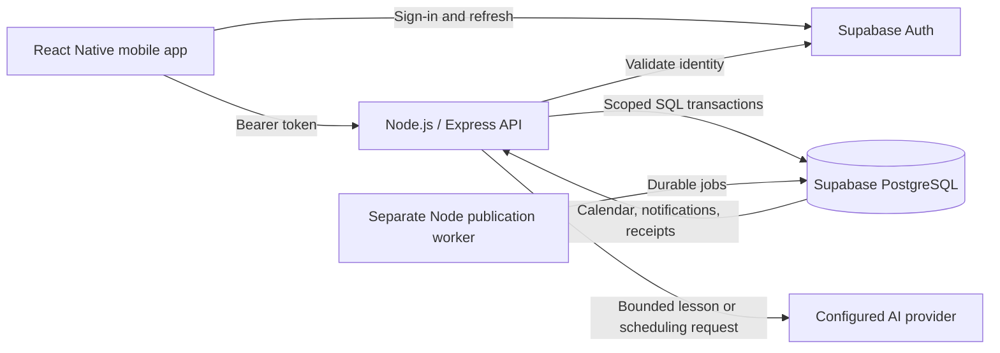

# ClassAssist mobile architecture

The client is a **React Native + TypeScript mobile application built with Expo**, targeting Android and iOS. There is no web frontend. This supersedes the web-first assumption in the original proposal.

## Boundaries

- Sessions use Expo SecureStore, chunked for keychain limits. No service key or database password ships in the app.
- The API validates tokens with Supabase `getUser` and loads trusted school/role assignments from `classassist.profiles`. The seed/admin path assigns teachers; students cannot self-promote.
- Tables live in the non-exposed `classassist` schema. `anon` and `authenticated` have no schema/table grants; RLS is enabled as defense in depth. The Node database connection is privileged, so application authorization is enforced in scoped service queries. A dedicated least-privilege server login is recommended before a school pilot.
- Teacher/student advisory locks serialize booking and cancellation in consistent UUID order. Availability, buffer, horizon, notice, and participant conflicts are rechecked inside the transaction. `(student_id, request_key)` prevents duplicate bookings; mismatched retries are rejected.
- Private answer keys stay on the server. Student serialization returns question IDs, prompts, and options only during the approved answering window. Enrollment is checked on every protected request.
- Approval binds a digest of content, answers, lesson, class, audience, dates, duration, and version. Editing invalidates approval, cancels pending jobs, and removes superseded notifications/calendar visibility. Opened quizzes cannot be edited.
- The separate worker locks the aggregate and job row, performs in-database effects, and marks completion in one transaction. Connection loss rolls back all effects, leaving work retryable without an external-effect lease. Unique keys prevent duplicate delivery. Failures use bounded backoff and a teacher retry action after exhaustion.
- Assessment calendar events belong to the class: current active members, including later joiners, can see them; removed students cannot. Notifications are membership-filtered. Push/email/external calendar delivery is not implemented.
- Attempts have server-created deadlines bounded by closing time. Saves validate question/option IDs. Submission retries return the committed receipt; removed membership still denies access.

## Actual scope

Implemented: synthetic account sign-in, classes, expiring/rotatable/revocable enrollment codes, enrollment preview/confirmation, roster removal, weekly consultation windows and blocked dates, slot search, confirmed/cancelable bookings, AI intent parsing adapter, lesson-based five-question draft adapter, labeled sample draft, editable teacher review, exact-version approval/cancellation, durable publication/reminders, calendar, read notifications, online answer saving, submissions, teacher response review, and job retry.

Live AI requires `AI_API_KEY` and `AI_MODEL`; without them the UI disables generation and labels the saved sample. No live response has been verified in this environment.

Deferred: institutional provisioning UI/self-registration, arbitrary time zones (demo uses Asia/Manila), interval-specific exceptions (whole blocked dates supported), separate working-hour constraints, device push, external calendars, integrity logging, scoring, PDF import, offline assessments, and app-store delivery. Competition slides/submission and measured impact claims are separate deliverables.

Deploy API and worker as persistent services with HTTPS endpoints. This implementation uses an isolated local Supabase instance; unrelated hosted projects were not changed.
